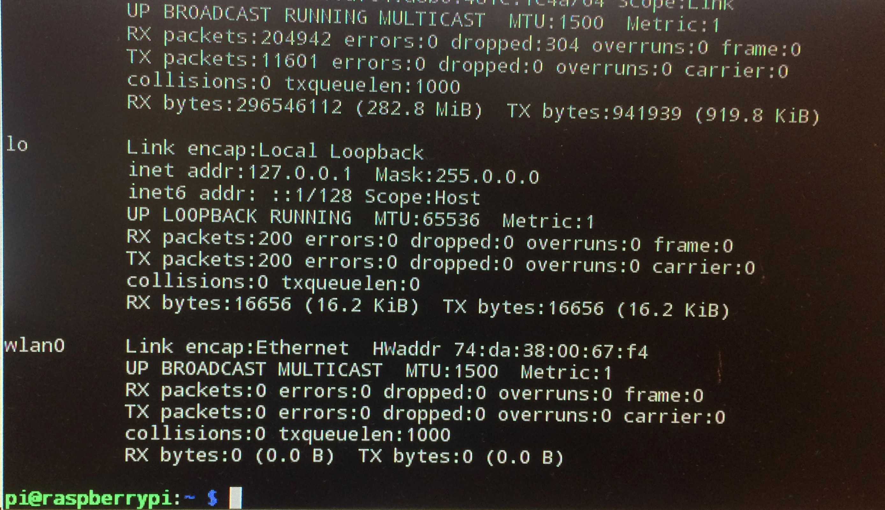
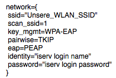
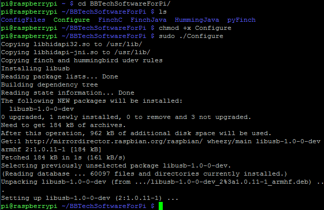
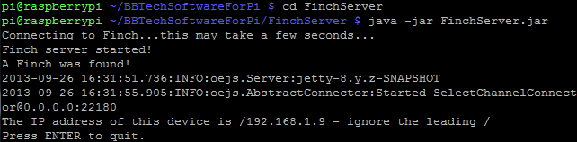

# Finch läuft auch ohne Leine

Informatikprojekt zum 21.11.2016 von Alina Drechsel und Jonida Kajolli

## Inhaltsverzeichnis

[1. Der Beginn mit Snap! und FinchRobot](#1)  
[2. Der Weg zum kabellosen Finch](#2)  
[3. Fazit](#3)

### Der Beginn mit Snap! und FinchRobot

#### Die Programmiersprache Snap!

Snap! ist eine blockbasierte Programmiersprache und ist zugleich eine Scratch Modifikation und der Nachfolger von BYOB und somit auch von Chrip. Unter Scratch Modifikationen wird eine Weiterentwicklung der Scratch Entwicklungsumgebung verstanden. BYOB ist eine der wichtigsten Scratch Modifikationen und der Nachfolger von Chrip und somit der Vorgänger von Snap!. BYOB steht für „Build Your Own Blocks“. Dies ermöglicht neue Blöcke in Form von eigenen Skripten zu definieren. Chrip ist eine weitere Modifikation der Scratch Entwicklungsumgebung, jedoch sehr veraltet. 
Genau so wie Scratch ist Snap! weitgehend eine befehlsgebende Programmiersprache bei der ein Programm aus einer Anregung von Anweisung besteht, die vorgeben, in welcher Reihenfolge die Aktionen ausgeführt werden.
Snap! basiert nicht auf den Quellende von Scratch selbst, sondern wurde komplett neu programmiert,  um nun die eigenen Projekte speichern zu können sowie überall online an seinen Projekten arbeiten kann. Ebenfalls muss Snap! nicht mehr installiert werden, sondern läuft als JavaScript-Anwendung im Browser (http://snap.berkeley.edu/snapsource/snap.html). 

#### FinchRobot

Der FinchRobot ist ein kleiner Roboter, der es ermöglicht, geschriebene Codes auszuführen.  FinchRobot unterstützt die Programmiersprachen Snap!, Scratch, LabVIEW, Python, Processing, Greenfoot sowie Java. Er wurde entwickelt, um es jedem zu ermöglichen, einen Einstieg in die Grundlagen des rechnerischen Denken bis hin zum Schreiben interaktiver Programme zu geben. Der FinchRobot verfügt über Distanz-, Helligkeits-, Temperatur- und Längensensoren.

### Der Weg zum kabellosen Finch

#### Raspberry Pi

Allgemein ausgedrückt ist der Raspberry Pi ein Mini-Computer. Da dieser Einplatinencomputer ursprünglich für Schüler und Studenten gedacht war, ist dieser mit rund 35 Euro sehr kostengünstig. Ein Raspberry Pi ermöglicht den Erstkontakt zu Linux, Shell Scripting, Programmieren sowie Physical Computing. Zusätzlich lernt man nebenbei viel über die grundsätzlichen Funktionsweisen von Computern. 

#### Dokumentation über unsere Arbeit

Unser FinchRobot wurde am 29.09.2016 zum Leben erweckt. Anfangs beschäftigten wir uns mit den Aufgaben zum Umgang mit FinchRobot. Wir nutzten dazu die geeignete Seite von FinchRobot (http://finchrobot.com/teaching/snap-grades-9-12). Die vielen Aufgaben dienten dazu, den Umgang mit FinchRobot zu vertiefen. In den aktiven Arbeitsphasen störte uns das Kabel, welches den FinchRobot mit dem Computer verbindet, da dieses ihn hindert, die Befehle sinngemäß auszuführen. Dementsprechend lief FinchRobot immer in eine Richtung gedreht, obwohl er beispielsweise geradeaus laufen sollte. 
Wie können wir dieses Problem beheben? Nach langwierigen Überlegungen sind wir auf den Raspberry Pi aufmerksam geworden. Dieser würde es ermöglichen, FinchRobot ohne ein nerviges Kabel, unseren Befehlen nachzukommen, indem wir, grob gesagt, eine Software installieren sowie 
eine Konfiguration von Java, um später in Snap! Befehle schreiben zu können. Zudem ist ein Raspberry Pi klein genug, um auf den FinchRobot zu passen. Bis es jedoch soweit ist, dauert es seine Zeit. Im nachfolgenden Teil werden wir unseren Arbeitsprozess detailliert erläutern. 

Bevor wir beginnen konnten, mussten wir eine Menge an Materialien zusammensuchen. 
- einen Raspberry Pi Modell B
- eine 4GB oder höhere SD-Karte/ Mirco SD-Karte
- eine Energiequelle für den Raspberry Pi (mobile Akkubox)
- USB-Wireless-Adapter
- Maus
- Tastatur
- Bildschirm
- DVI/HDMI-Kabel je nach Bildschirm
- USB auf MicroUSB Kabel
- LAN-Kabel

Das Anschließen der vielen einzelnen Komponenten erfolgte ohne Probleme. Und nun? Wie bekommen wir den Raspberry Pi zum Laufen? Keiner von uns beiden hat bisher Erfahrungen mit dem Einplatinencomputer gesammelt. Im Endeffekt entschieden wir uns dafür, die Anleitung der FinchRobot-Internetseite (http://finchrobot.com/learning/raspberry-pi) zu folgen und bei Problemen sowie bei Unverständnis auf anderen Seiten nachzuschauen.
Ein Raspberry Pi benötigt ein Betriebsystem, um erfolgreich starten zu können. Wir legten uns dabei auf den BerryBoot installer (http://www.berryterminal.com/doku.php/berryboot) fest und haben die Version für the original Raspberry Pi, Pi Zero, Pi 2 and Pi 3 (53 MB): berryboot-20161118-pi0-pi1-pi2-pi3.zip auf die SD-Karte geladen, welche währenddessen in einem externen Computer steckte. Danach mussten wir die darin enthaltene Zip-Datei entpacken. Nach  einem erfolgreichen Abschluss mussten wir sicherstellen, dass wir eine Internetverbindung haben, auf die der Raspberry Pi zugreifen kann. Dies lösten wir mit einem vorhandenen Lan-Kabel aus der Schule. Anschließend steckten wir die SD-Karte wieder zurück in den Raspberry Pi und schlossen ebenfalls ein Kabel zur Stromversorgung an. Darauf folgend ist er von selbst hochgefahren, da er keinen Ein- beziehungsweise Ausschaltknopf besitzt und beobachteten ihn beim Booten. Nach einigen Minuten wurde uns dieses Bild auf der Benutzeroberfläche angezeigt.

Nun waren wir aufgefordert, die empfohlene Linux-Distribution Debian basierend auf Raspbian auszuwählen, welche sich bereits auf der beschriebenen SD-Karte befindet. Die Installation nahm einen langen Zeitraum in Anspruch und wir drehten für wenige Stunden unsere Däume. Währenddessen wurde uns der Fortschritt des Installationsprozesses angezeigt.

######Exkurs

> Debian ist ein gemeinschaftlich entwickeltes freies Betriebssystem. Dieses basiert auf einem Debian-8-System und den grundlegenden  
> Systemwerkzeugen des GNU-Projektes sowie dem Linux-Kernel. (GNU ist ein unixähnliches Betriebsystem und eine völlig freie Software. Es > wird heutzutage in der Regel mit dem Linus-Kernel genutzt. Diese Kombination wird GNU/Linux-Betriebssystem, verkürzt Linux, genannt.) >  Debian enthält eine große Auswahl an Anwendungsprogrammen; derzeit sind es über 43.000 Programmpakete. Entwickelt wurde Debian im August 
> 1993 von Ian Murdock.  Als grafische Oberfläche wird LXDE vorkonfiguriert. Das etwa 3 GB große Image kann auf SD-Karten mit 4 GB oder >  mehr übertragen werden. Nach dem Bootvorgang kann die Größe der Raspbian-Partition auf die komplette SD-Karte erweitert werden. Die  >  Raspberry Pi Foundation erstellt auf Basis der Raspbian-Distribution ein eigenes Raspbian-Image mit passender Firmware für die  
> Raspberry-Pi-Modelle.

Nach der erfolgreichen Installation ist es notwendig, den Raspberry Pi neu zu starten, um weitere grundlegende Konfigurationen vorzunehmen. Dazu gehören die Konfiguration der Sprache, Zeichensatz, Zeitzone und ein deutsches Tastatur-Layout. Nun war die Grundkonfiguration endlich fertig. Für die Konfiguration von Raspbian existiert ein Konfigurations-Tool unter "Preferences > Raspberry Pi Configuration". Damit haben wir die wichtigen Dinge schnell konfigurieren können, ohne dass wir komplizierte Kommandos im Terminal eingeben mussten. Anschließend starten wir den Raspberry Pi erneut.

Um mit dem Raspberry Pi weiter arbeiten zu können, mussten wir alle im Betriebsystem enthaltenen Pakete aktualisieren, indem wir im Terminal die Kommandos "sudo apt-get update“ und nach erfolgreichen Durchlauf dann "sudo apt-get upgrade“ eingaben. Dies kostete uns ein weiters mal lange Zeit.

Der erste Schritt war gemeistert. 
Wir gaben den Befehl „ifconfig“ im Terminal ein, um zu schauen, ob unser USB-Wireless-Adapter im System erkannt wurde. ifconfig steht für „interface configurator“ und zeigt einem die IP-Netzwekschnittstellen an. Da uns die Schnittstelle „wlan0“ angezeigt wurde, sind wir davon ausgegangen, dass unser Raspberry Pi nun über den USB-Wireless-Adapter eine Internetverbindung besitzt. 

www.google.de? Fehlanzeige! Der USB-Wireless-Adpater kommuniziert nicht mit dem Schulnetzwerk. Das bedeutet, wir haben keine aktive Internetverbindung. Der Adapter wird vom System erkannt, wird aber nicht in das bestehende Netzwerk eingebunden. Ahnungslosigkeit herrschte in unseren Köpfen. Wie bekommen wir das hin, dass der Raspberry Pi endlich eine Internetverbindung bekommt. Anfangs wurden wir durch das internet nicht schlauer, da wir leider nicht genau wussten, wonach wir suchen sollte. Aus diesem Grund fragten wir Herr Buhl um Hilfe.
Er löste unser Problem, indem er in der Datei „/etc/wpa_supplicant/wpa_supplicant.conf“ eine Änderung vornahm. 

Der Inhalt dieser Datei wird beispielsweise auf dieser Internetseite beschrieben https://linux.die.net/man/5/wpa_supplicant.conf. 

Durch die Änderung wurde ebenfalls eine in den IP-Netzwerkschnittstellen vorgenommen. Unsern Raspberry Pi wurde eine IP-Adresse zugewiesen. Wenn nun der Befehl „sudo_ wpa_supplicant -i plan -c /etc/wpa_supplicant/wpa_supplicant.conf“ in das Terminal eingeben wird, kommuniziert der Pi mit dem Wlan des Schulnetzes. Die Freude war groß, als wir die positive Nachricht überwiesen bekommen haben!

Wir wollten es gleich selber ausprobieren. Na toll… Wir haben keine Internetverbindung. Die Freude war von null auf hundert verschwunden. Was haben wir falsch gemacht. Herr Buhl meinte doch, es würde funktionieren. 

Schnell realisierten wir, dass bei jedem Neustart des Raspberry Pi diese Einstellung erneut manuell vorgenommen werden müsste. Da dies jedoch für unsere Zwecke eher unpraktisch wäre, suchten wir nach einer Möglichkeit, diese Einstellung bei jedem Neustart automatisch ablaufen zu lassen. Nach kurzer Internetrecherche wustten wir, dass wir in "/etc/network/interfaces" die Zeile "wpa-conf /etc/wpa_supplicant/wpa_supplicant.conf" hinzufügen mussten, welche die Internetverbindung automatisch aufbaute. 

Endlich haben wir es geschafft. Erleichterung pur. Nun konnten wir endlich ungestört weiterarbeiten. 
Um den FinchRobot nun kabellos zu bekommen, war es nötig auch den Rasbperry Pi aus der Ferne steuern zu können.
Da uns nun die IP-Adresse bekannt war, konnten wir Putty unter Windows öffnen und uns in den Raspberry Pi einloggen. Um nun auch Dateien auf den Mini-Computer zu installieren, ist dies einfacher, wenn die Software auf einen Host-Computer heruntergeladen wird und dann über das Programm (in unserem Fall) „WinSCP“ auf den Pi zu übertragen. Zudem benötigten wir eine Remote-Desktop-Software, um den Desktop des Raspberry Pi von unserem Host-Computer anzuschauen. Dafür verwendeten wir TightVNC. Um dieses Programmm zu installieren gaben wir folgenden Befehl in Putty ein „sudo apt-get install tightvncserver herunterladen“. Wenn wir den Remote-Desktops zulassen wollen, gaben wir den Befehl „Tightvncserver“ ein. Beim ersten Starten des Remote-Desktops wurden wir aufgefordert, ein Passwort einzugeben und andere Konfigurationsoptionen einzurichten. Jedes mal wenn wir den Befehl ausführen, wird uns "Neuer 'X' Desktop ist raspberrypi: 1“ angezeigt.

Der nächste Schritt war die Installation und Konfiguration von Java, um den Snap-Server zu kompilieren und um diesen später auszuführen. Im Terminal mussten wir dazu zuerst den Befehl „sudo apt-get update“ und anschließend den Befehl „sudo apt-get install oracle-java7-jdk“ eingeben. Dieser Schritt konnten wir erfolgreich ohne Probleme ausführen.

Folgend darauf mussten wir eine Konfiguration für FinchRobot durchführen. Dazu mussten wir und sie Birdbrain Technologies Software für den Raspberry pi auf einem host-Computer herunterladen und diese Datei n das Verzeichnis des Raspberry Pi kopieren. Danach mussten wir im Terminal in ~ / BBTechSoftwareForPi wechseln und weitere Kommandos eingeben (siehe Bild)

Endlich waren wir beim aller letzten Schritt angekommen. Es war eine lange, aufregende und wissenswerte Zeit bis dahin. Wir haben sehr viel über den Raspberry Pi gelernt. Der letzte Schritt war die Installation eines Servers, mit dem wir FinchRobot mit der Snap! Programmierumgebung von einem entfernten Computer aus steuern können. Dazu mussten wir den Server auf dem rad-berry Pi starten, indem wir zum Verzeichnis „FinchServer“ im Ordner „BBTechSoftwareforPi“ den Befehl "java -jar FinchServer.jar" eingegeben haben.

Anschließend mussten wir nur noch die reguläre Seite von Snap! auf einem Computer mit dem gleichen lokalen Netzwerk wie der Raspberry Pi öffnen (http://snap.berkeley.edu/snapsource/snap.html). Der aller letzte Schritt erfolgte mit dem Import einer Datei (https://dl.dropboxusercontent.com/u/9303915/FinchPiSnapBlocks.xml). Diese Datei zogen wir in Snap! und änderten folgend die IP-Adresse im „set“-Block.

Wir haben es geschafft! FinchRobot ist ab sofort kabellos und kann frei „herumlaufen“.

### Fazit

Es war ein spannendes Projekt, welches uns in die Arbeit mit dem Raspberry Pi einführte und darüber hinaus unsere Programmierfähigkeiten stark ausbaute. 
Als wir uns für das Projekt entschieden, haben wir nicht erwartet, dass wir die größte Arbeit damit haben werden, eine vernünftige WLAN- Verbindung für den Raspberry Pi aufzubauen. Es gab viele kleine Hürden zu überwinden, einige brachten uns nahezu zum verzweifeln und an manchen Punkten war es recht frustrierend, wenn nichts funktionierte, wie es sollte. Aber gerade diese Rückschläge machten uns umso ehrgeiziger und es um so erfreulicher, wenn nach langer Zeit der Versuche und Zusammenarbeit endlich an sein Ziel gelangt. 
Alles in allem freuen wir uns auf die weitere Arbeit mit unserem kabellosen Finch.
