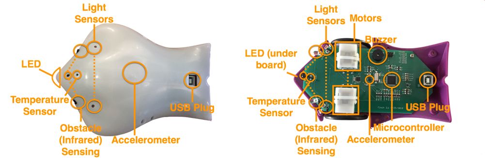
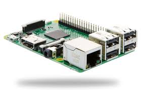
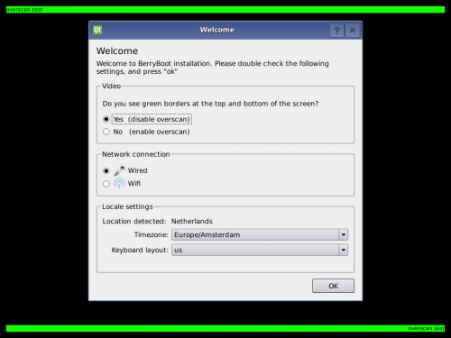
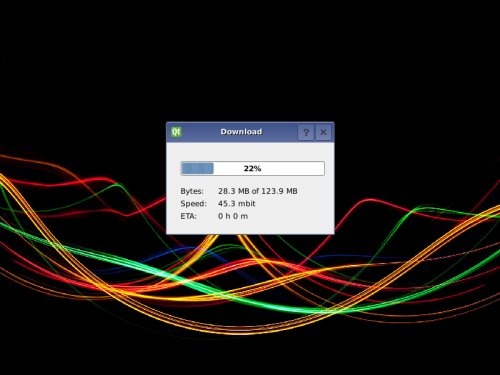
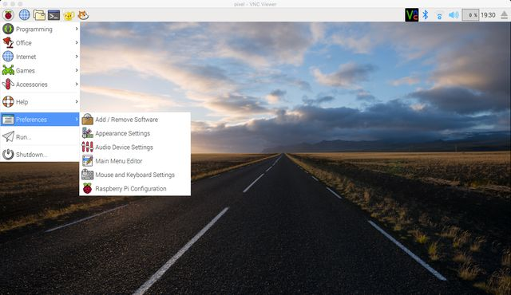

# Finch läuft auch ohne Leine

Informatikprojekt zum 21.11.2016 von Alina Drechsel und Jonida Kajolli

## Inhaltsverzeichnis

[1. Der Beginn mit Snap! und FinchRobot](#1)  
[2. Der Weg zum kabellosen Finch](#2)  
[3. Fazit](#3)

### Der Beginn mit Snap! und FinchRobot

#### Die Programmiersprache Snap!

Snap! ist eine blockbasierte Programmiersprache und ist zugleich eine Scratch Modifikation und der Nachfolger von BYOB und somit auch von Chrip. Unter Scratch Modifikationen wird eine Weiterentwicklung der Scratch Entwicklungsumgebung verstanden. BYOB ist eine der wichtigsten Scratch Modifikationen und der Nachfolger von Chrip und somit der Vorgänger von Snap!. BYOB steht für „Build Your Own Blocks“. Dies ermöglicht neue Blöcke in Form von eigenen Skripten zu definieren. Chrip ist eine weitere Modifikation der Scratch Entwicklungsumgebung, jedoch sehr veraltet. 
Genau so wie Scratch ist Snap! weitgehend eine befehlsgebende Programmiersprache bei der ein Programm aus einer Anregung von Anweisung besteht, die vorgeben, in welcher Reihenfolge die Aktionen ausgeführt werden.
Snap! basiert nicht auf den Quellende von Scratch selbst, sondern wurde komplett neu programmiert,  um nun die eigenen Projekte speichern zu können sowie überall online an seinen Projekten arbeiten kann. Ebenfalls muss Snap! nicht mehr installiert werden, sondern läuft als JavaScript-Anwendung im Browser (http://snap.berkeley.edu/snapsource/snap.html). 

#### FinchRobot

Der FinchRobot ist ein kleiner Roboter, der es ermöglicht, geschriebene Codes auszuführen.  FinchRobot unterstützt die Programmiersprachen Snap!, Scratch, LabVIEW, Python, Processing, Greenfoot sowie Java. Er wurde entwickelt, um es jedem zu ermöglichen, einen Einstieg in die Grundlagen des rechnerischen Denken bis hin zum Schreiben interaktiver Programme zu geben. Der FinchRobot verfügt über Distanz-, Helligkeits-, Temperatur- und Langesensoren.

### Der Weg zum kabellosen Finch

#### Raspberry Pi

Allgemein ausgedrückt ist der Raspberry Pi ein Mini-Computer. Da dieser Einplatinencomputer ursprünglich für Schüler und Studenten gedacht war, ist dieser mit rund 35 Euro sehr kostengünstig. Ein Raspberry Pi ermöglicht den Erstkontakt zu Linux, Shell Scripting, Programmieren sowie Physical Computing. Zusätzlich lernt man nebenbei viel über die grundsätzlichen Funktionsweisen von Computern. 

#### Dokumentation über unsere Arbeit

Unser FinchRobot wurde am 29.09.2016 zum Leben erweckt. Anfangs beschäftigten wir uns mit den Aufgaben zum Umgang mit FinchRobot. Wir nutzten dazu die geeignete Seite von FinchRobot (http://finchrobot.com/teaching/snap-grades-9-12). Die vielen Aufgaben dienten dazu, den Umgang mit FinchRobot zu vertiefen. In den aktiven Arbeitsphasen störte uns das Kabel, welches den FinchRobot mit dem Computer verbindet, da dieses ihn hindert, die Befehle sinngemäß auszuführen. Dementsprechend lief FinchRobot immer in eine Richtung gedreht, obwohl er beispielsweise geradeaus laufen sollte. 
Wie können wir dieses Problem beheben? Nach langwierigen Überlegungen sind wir auf den Raspberry Pi aufmerksam geworden. Dieser würde es ermöglichen, FinchRobot ohne ein nerviges Kabel, unseren Befehlen nachzukommen, indem wir, grob gesagt, eine Software installieren sowie 
eine Konfiguration von Java, um später in Snap! Befehle schreiben zu können. Zudem ist ein Raspberry Pi klein genug, um auf den FinchRobot zu passen. Bis es jedoch soweit ist, dauert es seine Zeit. Im nachfolgenden Teil werden wir unseren Arbeitsprozess detailliert erläutern. 

Bevor wir beginnen konnten, mussten wir eine Menge an Materialien zusammensuchen. 
- einen Raspberry Pi Modell B
- eine 4GB oder höhere SD-Karte/ Mirco SD-Karte
- eine Energiequelle für den Raspberry Pi (mobile Akkubox)
- USB-Wireless-Adapter
- Maus
- Tastatur
- Bildschirm
- DVI/HDMI-Kabel je nach Bildschirm
- USB auf MicroUSB Kabel
- LAN-Kabel

Das Anschließen der vielen einzelnen Komponenten erfolgte ohne Probleme. Und nun? Wie bekommen wir den Raspberry Pi zum Laufen? Keiner von uns beiden hat bisher Erfahrungen mit dem Einplatinencomputer gesammelt. Im Enddefekt entschieden wir uns dafür, die Anleitung der FinchRobot-Internetseite (http://finchrobot.com/learning/raspberry-pi) zu folgen und bei Problemen sowie bei Unverständnis auf anderen Seiten nachzuschauen.
Ein Raspberry Pi benötigt ein Betriebsystem, um erfolgreich starten zu können. Wir legten uns dabei auf den BerryBoot installer (http://www.berryterminal.com/doku.php/berryboot) fest und haben die Version für the original Raspberry Pi, Pi Zero, Pi 2 and Pi 3 (53 MB): berryboot-20161118-pi0-pi1-pi2-pi3.zip auf die SD-Karte geladen, welche währenddessen in einem externen Computer steckte. Danach mussten wir die darin enthaltene Zip-Datei entpacken. Nach  einem erfolgreichen Abschluss mussten wir sicherstellen, dass wir eine Internetverbindung haben, auf die der Raspberry Pi zugreifen kann. Dies lösten wir mit einem vorhandenen Lan-Kabel aus der Schule. Anschließend steckten wir die SD-Karte wieder zurück in den Raspberry Pi und schlossen ebenfalls ein Kabel zur Stromversorgung an. Darauf folgend ist er von selbst hochgefahren, da er keinen Ein- beziehungsweise Ausschaltknopf besitzt und beobachteten ihn beim Booten. Nach einigen Minuten wurde uns dieses Bild auf der Benutzeroberfläche angezeigt.

Nun waren wir aufgefordert, die empfohlene Linux-Distribution Debian basierend auf Raspbian auszuwählen, welche sich bereits auf der beschriebenen SD-Karte befindet. Die Installation nahm einen langen Zeitraum in Anspruch und wir drehten für wenige Stunde unsere Däume. Währenddessen wurde uns der Fortschritt des Installationsprozess angezeigt.

######Exkurs

Debian ist ein gemeinschaftlich entwickeltes freies Betriebssystem. Dieses basiert auf einem Debian-8-System und den grundlegenden Systemwerkzeugen des GNU-Projektes sowie dem Linux-Kernel. (GNU ist ein unixähnliches Betriebsystem und eine völlig freie Software. Es wird heutzutage in der Regel mit dem Linus-Kernel genutzt. Diese Kombination wird GNU/Linux-Betriebssystem, verkürzt Linux, genannt.) Debian enthält eine große Auswahl an Anwendungsprogrammen; derzeit sind es über 43.000 Programmpakete. Entwickelt wurde Debian im August 1993 von Ian Murdock.  Als grafische Oberfläche wird LXDE vorkonfiguriert. Das etwa 3 GB große Image kann auf SD-Karten mit 4 GB oder mehr übertragen werden. Nach dem Bootvorgang kann die Größe der Raspbian-Partition auf die komplette SD-Karte erweitert werden. Die Raspberry Pi Foundation erstellt auf Basis der Raspbian-Distribution ein eigenes Raspbian-Image mit passender Firmware für die Raspberry-Pi-Modelle.

Nach der erfolgreichen Installation ist es notwendig, den Raspberry Pi neu zu starten, um weitere grundlegende Konfigurationen vorzunehmen. Dazu gehören die Konfiguration der Sprache, Zeichensatz, Zeitzone und ein deutsches Tastatur-Layout. Nun war die Grundkonfiguration endlich fertig. Für die Konfiguration von Raspbian existiert ein Konfigurations-Tool unter "Preferences > Raspberry Pi Configuration". Damit haben wir die wichtigen Dinge schnell konfigurieren können, ohne dass wir komplizierte Kommandos im Terminal eingeben mussten.
